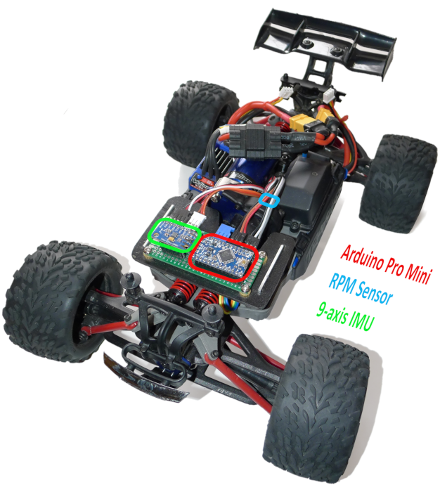

# VK RcCat

**RcCat provides next generation driving aids for Rc Cars.**

A microcontroller with several sensors intercepts the drive commands from the receiver
and sending optimized signals to the steering servo and the speed controller.
As a result, an RcCat (with a sufficiently strong drive train) can even land on all fours if it falls to the ground from a distance of about one meter.

My prototype is based on 1:16 **Traxxas Mini E-Revo**:

Car top view                   |  Car bottom view
:-----------------------------:|:----------------------------------:
  |  

## Repo parts
* **[car_firmware](/tree/master/car_firmware):** The core firmware of RcCat

* **[wlan_repeater](/tree/master/wlan_repeater):** Serial to Wlan bridge to send telemetry data via wlan during driving and update drive parameters.

* **[pyapps](/tree/master/pyapps):** Additional python tools to analyze RcCat telemetry data and adjust drive characteristics

