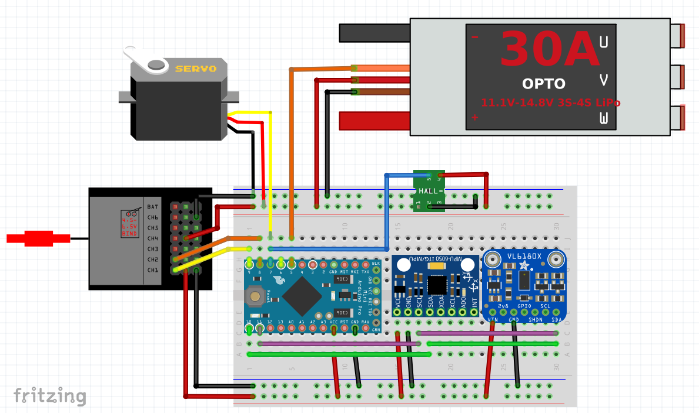

# VK RcCat

An automatic driving aid that takes over to land the RC car on all fours.

Car top view                   |  Car bottom view
:-----------------------------:|:----------------------------------:
  |  

## Schematic breadboard construction

## Bill of materials
* Arduino Pro Mini 5V
  https://store.arduino.cc/arduino-pro-mini
* 9 axis IMU MPU9250 @ 5Volt
  (many different possible)
* ToF range sensors VL6180
  https://www.sparkfun.com/products/12785
* Traxxas 6520 RPM Sensor
