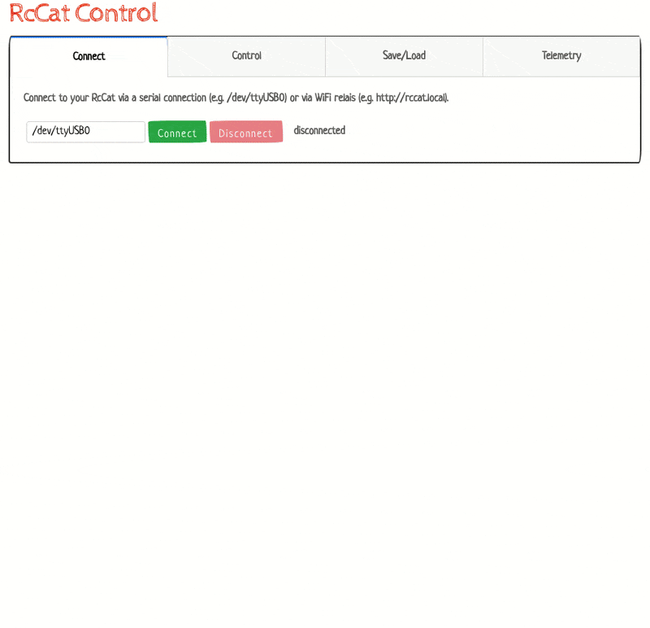

# VK RcCat :cat:

  

**RcCat provides next generation driving aids for Rc Cars.**

Ramp Jumps                     |  Garden Jumps                      |
:-----------------------------:|:----------------------------------:
   |     |

A microcontroller with several sensors intercepts the drive commands of the receiver
to send optimized signals to the steering servo and the speed controller.
During the flights, a minimalistic neural network is used to determine the next action.
As a result, my RcCat can land on all fours if it falls to the ground from a distance of about one meter.

My prototype is based on 1:16 **Traxxas Mini E-Revo**:

Car top view                   |  Car bottom view                   | Monitor App
:-----------------------------:|:----------------------------------:|:----------------------:
  |    | 

## Repo parts
* **[car_firmware](/car_firmware):** The core firmware of RcCat

* **[wlan_repeater](/wlan_repeater):** Serial to Wlan bridge to send telemetry data via wlan during driving and update drive parameters.

* **[pyapps](/pyapps):** Additional python tools to analyze RcCat telemetry data and adjust drive characteristics

