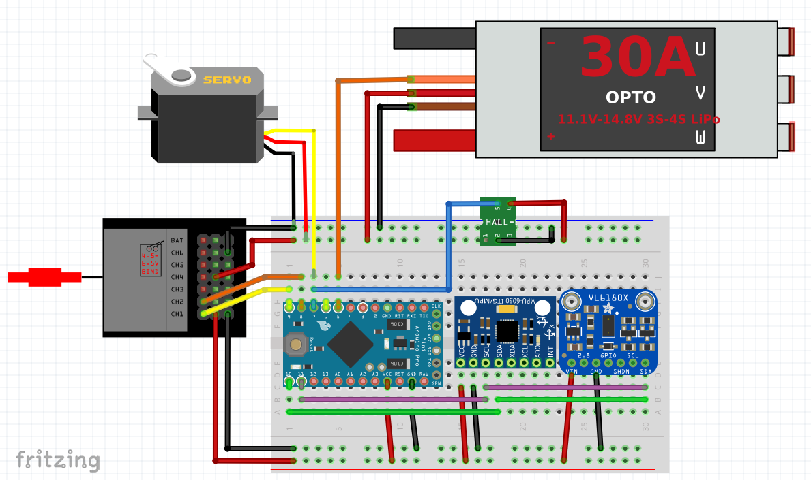

<a href="#"></a>

# VK RcCat Firmware


The main control of RcCat runs on a 5V Arduino Mini Pro. Feel free to use this repo and build your own RcCat firmware optimized for your RC model.

The firmware can be built form this PlatformIO project and consists of a few [classes](/car_firmware/src).


## Schematic breadboard setup
The components are connected as follows and communicate either via **I2C** (IMU and range sensor) bus or **PWM** (receiver, servo, RPM sensor and speed controller)



## Bill of materials
* Arduino Pro Mini 5V
  https://store.arduino.cc/arduino-pro-mini
* 9 axis IMU MPU9250 @ 5Volt
  (many different possible)
* ToF range sensors VL6180
  https://www.sparkfun.com/products/12785
* Traxxas 6520 RPM Sensor


##  Build
Install [PlatformIO](https://platformio.org/) for VsCode or your favorite IDE.
```
platformio run --target upload --target monitor
```