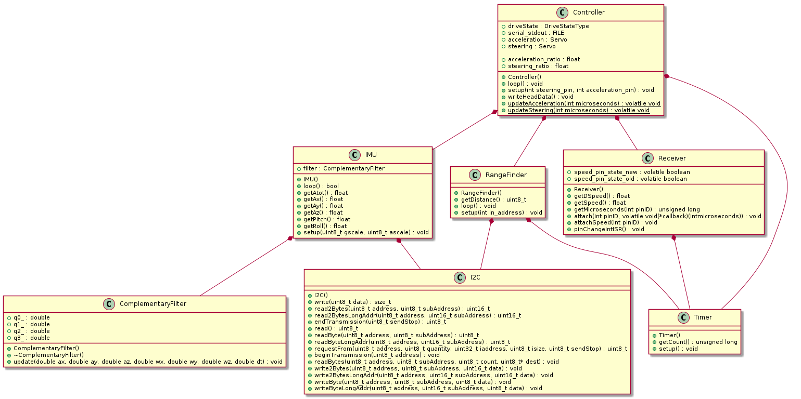

# VK RcCat Firmware

The firmware from RcCat consists of a few classes.

The main logic is handeled by the `Controller` class. For more information about the different `DriveStates` see the [ControllerStates subfolder](/ControllerStates).

To do this, the `Controller` collects information from the
* `IMU` class about rool and pitch 
* `RangeFinder`class about the ground distance
* `Receiver` class about the steering and acceleration input of the driver, as well as the current speed.

## Class overview
