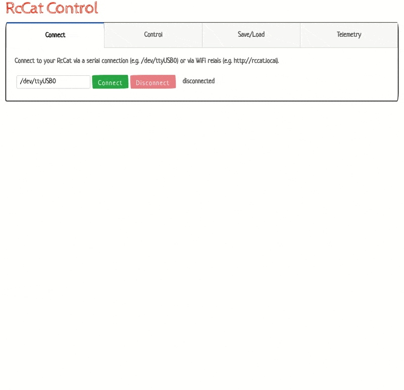

<a href="#"></a>

# VK RcCat Python Apps

This section contains a basic `monitor.py` Python app and an interface library for recording and monitoring telemetry data of RcCat and remote control steering, acceleration and internal parameters.


## The App in action
<div style="text-align:center"></div>

## Setup & Run
```javascript
//create and enter environment
pipenv install
pipenv shell

//start app
python monitor.py
```