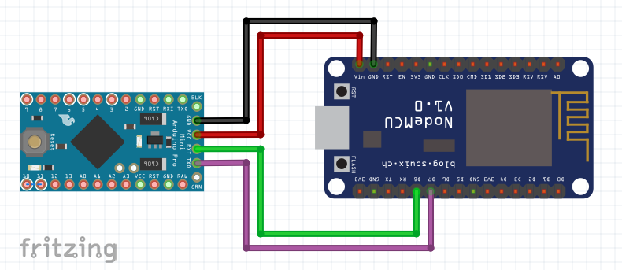

# VK RcCat WLAN repeater

In order to have the car telemetry data during test drives, I use a WLAN relay connected to the serial interface of the Arduino Mini Pro. The relais buffers up to 32kB of the sensor output in a circular buffer (a few seconds), which can be collected via WiFi.

Several WiFi enabled microcontrollers are possible, but I use a spare ESP8266 development board and directly wire it like:
 

 The ESP8266 creates a open WiFi with ssid `"RcCat-Wifi"` and publishes a web interface at [http://rccat.local/](http://rccat.local/).

 ### WiFi Endpoints
 * http://rccat.local/get serves a binary dump of the internal telemetry buffer.
 * http://rccat.local/write sends the body of the request via serial connection to the Mini Pro. This can be used to send controll commands or update drive parameters.
 * http://rccat.local/clear clears the recored telemetry buffer.

### Example

